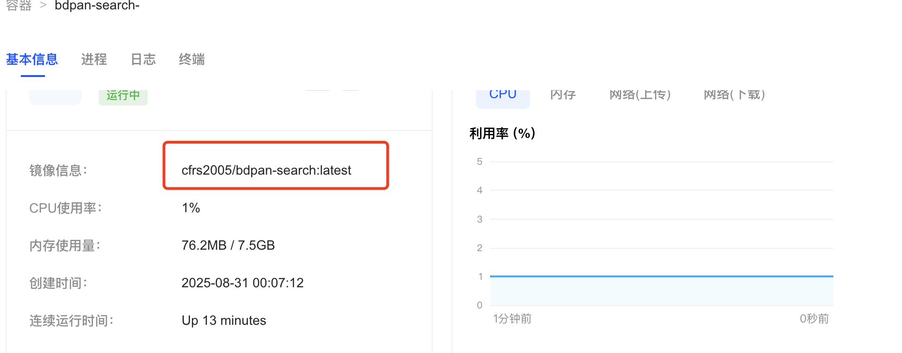
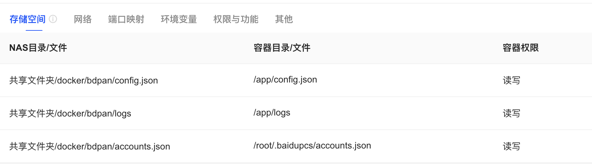
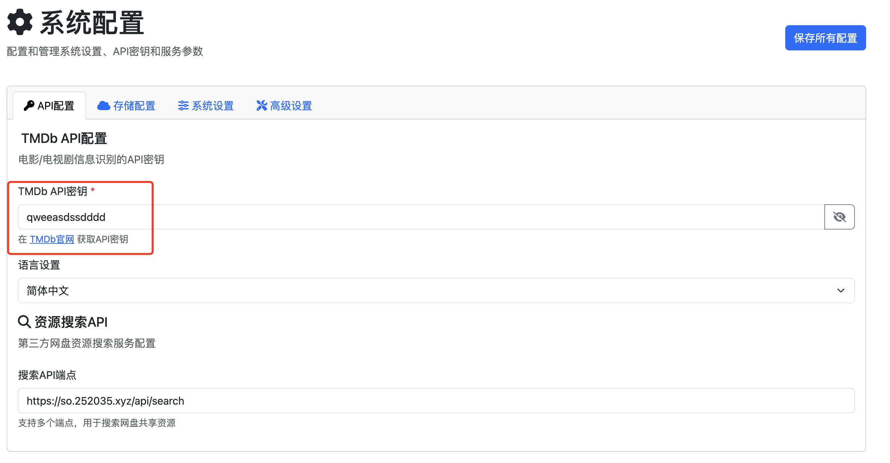
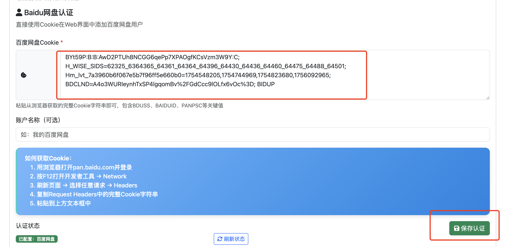

# 🚀 BDPan Search - 百度网盘智能搜索转存系统

<div align="center">


**一键搜索 | 智能识别 | 自动转存**

*专为绿联NAS优化的百度网盘资源管理工具*

[🏠 首页](http://localhost:5001) | [📚 文档](#) | [🐛 问题反馈](https://github.com/cfrs2005/bdpan/issues) | [💬 讨论区](https://github.com/cfrs2005/bdpan/discussions)

</div>

---

## 🌟 核心特性

<table>
<tr>
<td width="50%">

### 🎯 智能搜索引擎
- 🔍 **多源聚合**: 整合多个资源站点
- 🧠 **智能匹配**: TMDB数据库精准识别
- 🌐 **中英文支持**: 双语搜索无障碍
- ⚡ **实时结果**: 毫秒级搜索响应

</td>
<td width="50%">

### 🚀 一键转存系统  
- 📁 **自动分类**: 电影/电视剧智能归档
- 🔄 **批量操作**: 支持多个资源同时转存
- 💾 **持久化存储**: 断电重启数据不丢失
- 🛡️ **安全可靠**: Cookie加密存储

</td>
</tr>
<tr>
<td width="50%">

### 📊 实时监控面板
- 📈 **性能统计**: CPU/内存使用率监控
- 📋 **操作日志**: 详细的转存历史记录
- 🚦 **状态指示**: 系统健康状态一目了然
- 📱 **响应式设计**: 完美适配各种设备

</td>
<td width="50%">

### 🔧 专业配置管理
- ⚙️ **Web界面配置**: 无需命令行操作
- 🔑 **API密钥管理**: 安全的密钥存储
- 🎨 **主题定制**: 支持暗色/亮色模式
- 🌍 **多语言支持**: 简体中文界面

</td>
</tr>
</table>

## 📸 界面截图

### 主页搜索


### 历史记录管理


### 系统状态监控  


### 配置管理


### Chrome浏览器插件


## 📦 数据持久化

**重要**: 为确保用户认证信息和配置不会在容器重启后丢失，项目使用Docker数据卷进行持久化存储。

### 持久化数据类型

| 数据类型 | 存储位置 | 用途 | 数据卷名称 |
|----------|----------|------|-----------|
| 配置文件 | `/app/config.json` | API密钥、转存路径、服务器配置等 | 文件挂载 (可读写) |
| 用户认证 | `/root/.baidupcs/accounts.json` | 百度网盘Cookie、BDUSS等 | `bdpan-data` |
| 应用日志 | `/app/logs/` | 应用运行日志 | `bdpan-logs` |

### 数据备份与恢复

**备份用户认证数据**:
```bash
# 查看数据卷位置
docker volume inspect bdpan-data

# 备份认证数据
docker run --rm -v bdpan-data:/data -v $(pwd):/backup alpine tar czf /backup/bdpan-auth-backup.tar.gz -C /data .
```

**恢复认证数据**:
```bash
# 恢复认证数据
docker run --rm -v bdpan-data:/data -v $(pwd):/backup alpine tar xzf /backup/bdpan-auth-backup.tar.gz -C /data
```

## 🚀 快速开始

### 环境要求

- Docker & Docker Compose
- 绿联NAS或其他支持Docker的设备
- Python 3.8+ (本地运行)

### 方法一：绿联NAS部署 (推荐)

#### 1. 获取TMDB API密钥

访问 [TMDB API官网](https://www.themoviedb.org/settings/api) 获取免费API密钥：

1. 注册TMDB账户
2. 进入设置 → API页面
3. 申请API密钥（选择Developer）
4. 填写应用信息（个人使用即可）
5. 获得32位API Key（格式：`abcd1234efgh5678...`）

#### 2. 绿联NAS Docker部署

**容器基本信息配置**:


- **镜像名称**: `cfrs2005/bdpan-search:latest`
- **容器名称**: `bdpan-search`
- **运行状态**: 运行中
- **CPU使用率**: 通常在1%以下
- **内存使用**: 约76MB

**存储空间配置**:


配置以下目录映射确保数据持久化：
```
NAS目录                    → 容器目录                   → 权限
/docker/bdpan/config.json  → /app/config.json           → 读写
/docker/bdpan/logs         → /app/logs                  → 读写  
/docker/bdpan/accounts.json → /root/.baidupcs/accounts.json → 读写
```

#### 3. 系统配置

**API配置**:


在配置页面的"API配置"标签页中：
1. **TMDB API密钥**: 输入从TMDB官网获取的32位API Key
2. **语言设置**: 选择"简体中文"
3. **资源搜索API**: 保持默认 `https://so.252035.xyz/api/search`

**百度网盘认证**:


在"存储配置"标签页中：
1. **百度网盘Cookie**: 粘贴从浏览器获取的完整Cookie
2. **账户名称**: 给账户起个名字（可选）
3. 点击"保存认证"按钮

#### 4. Cookie获取详细步骤

1. 用浏览器打开 [pan.baidu.com](https://pan.baidu.com) 并登录
2. 按F12打开开发者工具 → Network
3. 刷新页面 → 选择任意请求 → Headers
4. 复制Request Headers中的完整Cookie字符串
5. 粘贴到绿联配置页面

**Cookie示例格式**:
```
BYt59P:B:B:AwD2PTUh8NCCG6qePp7XPAOgfKCsVzm3W9Y:C;
H_WISE_SIDS=62325_6364365_64361_64364_64396_64430_64436_64460_64475_64488_64501;
Hm_lvt_7a3960b6f067e5b7f96ff5e660b0=1754548205,1754744969,1754823680,1756092965;
BDCLND=A4o3WUReynhTxSP4lgqomBv%2FGdCcc9lOLfx6vOc%3D; BIDUP
```

### 方法二：使用 Docker Compose

1. **克隆项目**
```bash
git clone https://github.com/cfrs2005/bdpan.git
cd bdpan
```

2. **编辑配置**
```bash
# 编辑config.json，添加TMDB API密钥
nano config.json
```

3. **启动服务**
```bash
docker-compose up -d
```

4. **访问应用**
打开浏览器访问: http://localhost:5001

### 方法三：本地开发运行

> 🛠️ 适合开发者和高级用户

1. **📦 安装依赖**
```bash
pip install -r requirements.txt
```

2. **⚙️ 配置文件**
```bash
cp config.json.example config.json
# 编辑配置文件，添加TMDB API密钥
```

3. **🚀 启动服务**
```bash
python main.py
```

4. **🌐 访问应用**
打开浏览器访问: http://localhost:5001

## 🔧 配置说明

### config.json 配置

```json
{
  "tmdb_api_key": "你的TMDB API密钥",
  "tmdb_language": "zh-CN",
  "search_api_endpoint": "搜索服务API地址", 
  "movie_path": "/我的资源/2025/电影",
  "tv_path": "/我的资源/2025/电视剧",
  "server_host": "0.0.0.0",
  "server_port": 5001
}
```

### 百度网盘Cookie配置

系统启动后，通过Web界面配置百度网盘Cookie:
1. 访问配置页面: http://localhost:5001/config
2. 在"存储配置"标签页中添加百度网盘Cookie
3. Cookie获取方法：
   - 登录百度网盘网页版
   - 按F12打开开发者工具
   - 在Network标签页找到pan.baidu.com的请求
   - 复制完整Cookie值粘贴到配置页面

### Docker数据卷配置

项目使用以下数据卷确保数据持久化：

```yaml
volumes:
  # 配置文件 - 可读写挂载，支持Web界面修改配置
  - ./config.json:/app/config.json
  # 用户数据目录 - 存储百度网盘认证信息
  - bdpan-data:/root/.baidupcs
  # 应用日志目录
  - bdpan-logs:/app/logs
```

**数据卷说明**:
- `bdpan-data`: 存储用户通过Web界面配置的百度网盘认证信息
- `bdpan-logs`: 存储应用运行日志
- `config.json`: 文件挂载，存储API密钥、转存路径等配置（支持Web界面修改）

**⚠️ 重要提醒**: 
- 用户认证数据存储在 `bdpan-data` 数据卷中，容器删除后数据仍会保留
- 如需完全清理，请手动删除数据卷: `docker volume rm bdpan-data bdpan-logs`

## 🌐 API 接口

| 方法 | 路径 | 说明 |
|------|------|------|
| GET | `/` | 主页重定向 |
| GET | `/search` | 搜索页面 |
| GET | `/history` | 历史记录 |
| GET | `/status` | 系统监控 |
| GET | `/config` | 配置管理 |
| POST | `/api/save` | 搜索并转存 |
| GET | `/api/config` | 获取配置 |
| POST | `/api/config` | 保存配置 |
| GET | `/api/status/system` | 系统状态 |

## 🔌 Chrome插件

项目包含Chrome浏览器插件，支持一键收藏功能：

1. **安装插件**
   - 打开Chrome浏览器
   - 进入扩展管理页面 (chrome://extensions/)
   - 开启"开发者模式"
   - 点击"加载已解压的扩展程序"
   - 选择项目中的 `chrome-extension` 文件夹

2. **配置插件**
   - 点击插件图标进入设置页面
   - 设置后端服务地址：`http://localhost:5001`
   - 测试连接确保正常

3. **使用插件**
   - 在任何网页上选中电影/电视剧标题
   - 点击插件图标一键收藏到百度网盘

## 📁 项目结构

```
bdpan/
├── main.py                 # 主应用程序
├── auth_manager.py         # 认证管理模块
├── config.py              # 配置管理
├── Dockerfile             # Docker配置
├── docker-compose.yml     # 生产环境部署
├── docker-compose.dev.yml # 开发环境配置
├── requirements.txt       # Python依赖
├── config.json.example    # 配置模板
├── LICENSE               # MIT开源协议
├── templates/            # HTML模板
├── static/              # 静态资源
├── chrome-extension/    # Chrome插件
├── docs/               # 文档和截图
└── README.md
```

## 🤝 贡献指南

欢迎提交Issue和Pull Request！

1. Fork 项目
2. 创建功能分支 (`git checkout -b feature/AmazingFeature`)
3. 提交更改 (`git commit -m 'Add some AmazingFeature'`)
4. 推送到分支 (`git push origin feature/AmazingFeature`)
5. 打开 Pull Request

## 📄 许可证

本项目采用 MIT 许可证 - 查看 [LICENSE](LICENSE) 文件了解详情。

## ⭐ 致谢

- [BaiduPCS-Py](https://github.com/PeterDing/BaiduPCS-Py) - 百度网盘API支持
- [TMDB API](https://www.themoviedb.org/documentation/api) - 电影数据库API
- [Flask](https://flask.palletsprojects.com/) - Web框架

## 📞 支持

如果您在使用过程中遇到问题，请：

1. 查看 [常见问题](#)
2. 搜索已有的 [Issues](https://github.com/cfrs2005/bdpan/issues)
3. 创建新的 Issue 描述您的问题

---

⭐ 如果这个项目对您有帮助，请给我们一个星标！