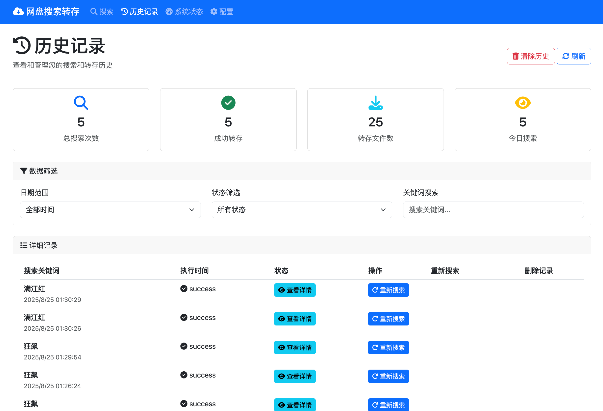
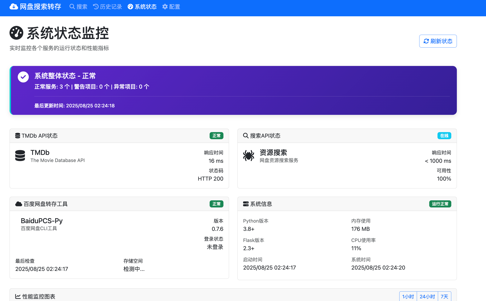
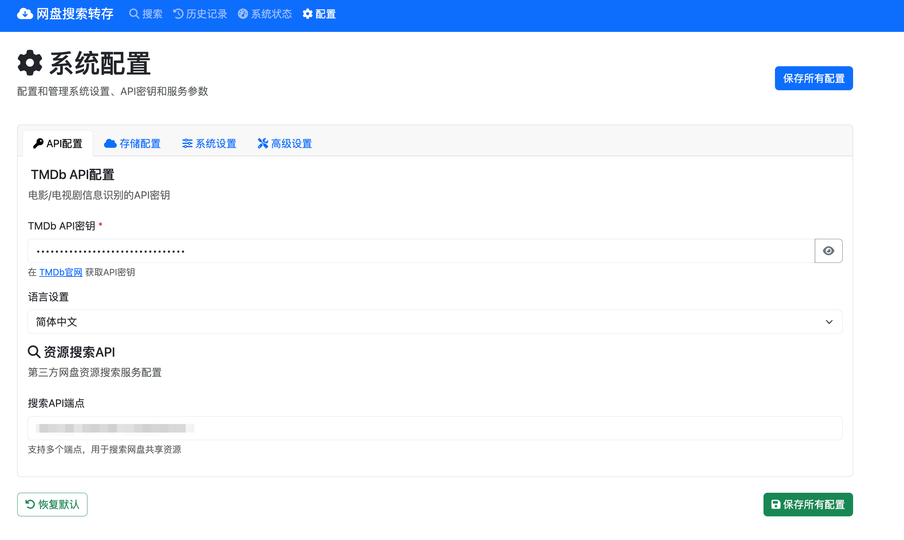
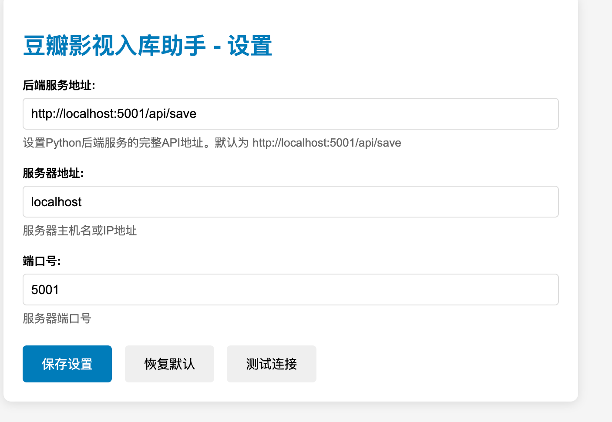

# 🔍 百度网盘搜索转存系统

> 一个强大的百度网盘资源搜索和转存工具，支持智能搜索、批量转存、历史记录管理和系统监控。

## ✨ 功能特性

- 🎬 **智能搜索**: 支持电影、电视剧等资源的中英文搜索
- 🚀 **快速转存**: 一键将搜索结果转存到百度网盘
- 📊 **实时监控**: 系统状态监控和性能统计
- 📝 **历史记录**: 完整的搜索和转存历史管理
- ⚙️ **灵活配置**: 支持API密钥、路径等配置管理
- 🌐 **现代界面**: 响应式设计，支持多设备访问
- 🔌 **Chrome插件**: 浏览器插件支持一键收藏

## 📸 界面截图

### 主页搜索


### 历史记录管理


### 系统状态监控  


### 配置管理


### Chrome浏览器插件


## 🚀 快速开始

### 环境要求

- Docker & Docker Compose
- Python 3.8+ (本地运行)

### 方法一：使用 Docker (推荐)

1. **克隆项目**
```bash
git clone https://github.com/cfrs2005/bdpan.git
cd bdpan
```

2. **配置文件**
```bash
# 复制配置文件模板
cp config.json.example config.json
cp cookie.txt.example cookie.txt

# 编辑配置文件，添加您的API密钥和Cookie
```

3. **启动服务**
```bash
# 生产环境
docker-compose up -d

# 开发环境 (支持热重载)
docker-compose -f docker-compose.dev.yml up -d
```

4. **访问应用**
打开浏览器访问: http://localhost:5001

### 方法二：本地运行

1. **安装依赖**
```bash
pip install -r requirements.txt
```

2. **配置文件**
```bash
cp config.json.example config.json
cp cookie.txt.example cookie.txt
# 编辑配置文件
```

3. **启动服务**
```bash
python main.py
```

## 🔧 配置说明

### config.json 配置

```json
{
  "tmdb_api_key": "你的TMDB API密钥",
  "tmdb_language": "zh-CN",
  "search_api_endpoint": "搜索服务API地址", 
  "movie_path": "/我的资源/2025/电影",
  "tv_path": "/我的资源/2025/电视剧",
  "server_host": "0.0.0.0",
  "server_port": 5001
}
```

### cookie.txt 配置

从百度网盘网页版获取Cookie:
1. 登录百度网盘网页版
2. 按F12打开开发者工具
3. 在Network标签页找到pan.baidu.com的请求
4. 复制Cookie值到cookie.txt文件

## 🌐 API 接口

| 方法 | 路径 | 说明 |
|------|------|------|
| GET | `/` | 主页重定向 |
| GET | `/search` | 搜索页面 |
| GET | `/history` | 历史记录 |
| GET | `/status` | 系统监控 |
| GET | `/config` | 配置管理 |
| POST | `/api/save` | 搜索并转存 |
| GET | `/api/config` | 获取配置 |
| POST | `/api/config` | 保存配置 |
| GET | `/api/status/system` | 系统状态 |

## 🔌 Chrome插件

项目包含Chrome浏览器插件，支持一键收藏功能：

1. **安装插件**
   - 打开Chrome浏览器
   - 进入扩展管理页面 (chrome://extensions/)
   - 开启"开发者模式"
   - 点击"加载已解压的扩展程序"
   - 选择项目中的 `chrome-extension` 文件夹

2. **配置插件**
   - 点击插件图标进入设置页面
   - 设置后端服务地址：`http://localhost:5001`
   - 测试连接确保正常

3. **使用插件**
   - 在任何网页上选中电影/电视剧标题
   - 点击插件图标一键收藏到百度网盘

## 📁 项目结构

```
bdpan/
├── main.py                 # 主应用程序
├── auth_manager.py         # 认证管理模块
├── config.py              # 配置管理
├── Dockerfile             # Docker配置
├── docker-compose.yml     # 生产环境部署
├── docker-compose.dev.yml # 开发环境配置
├── requirements.txt       # Python依赖
├── config.json.example    # 配置模板
├── cookie.txt.example     # Cookie模板
├── LICENSE               # MIT开源协议
├── templates/            # HTML模板
├── static/              # 静态资源
├── chrome-extension/    # Chrome插件
├── docs/               # 文档和截图
└── README.md
```

## 🤝 贡献指南

欢迎提交Issue和Pull Request！

1. Fork 项目
2. 创建功能分支 (`git checkout -b feature/AmazingFeature`)
3. 提交更改 (`git commit -m 'Add some AmazingFeature'`)
4. 推送到分支 (`git push origin feature/AmazingFeature`)
5. 打开 Pull Request

## 📄 许可证

本项目采用 MIT 许可证 - 查看 [LICENSE](LICENSE) 文件了解详情。

## ⭐ 致谢

- [BaiduPCS-Py](https://github.com/PeterDing/BaiduPCS-Py) - 百度网盘API支持
- [TMDB API](https://www.themoviedb.org/documentation/api) - 电影数据库API
- [Flask](https://flask.palletsprojects.com/) - Web框架

## 📞 支持

如果您在使用过程中遇到问题，请：

1. 查看 [常见问题](#)
2. 搜索已有的 [Issues](https://github.com/cfrs2005/bdpan/issues)
3. 创建新的 Issue 描述您的问题

---

⭐ 如果这个项目对您有帮助，请给我们一个星标！